<p align="center">
  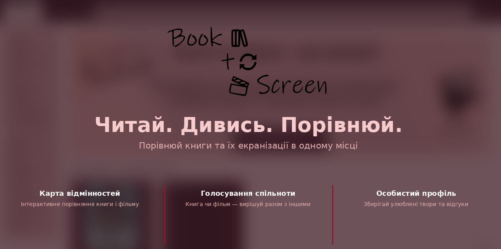
</p>

#  Book2Screen

> Читай. Дивись. Порівнюй. — Перша інтерактивна платформа для порівняння сюжетів книг та їх екранізацій.

[](https://github.com/kazikSUPER/Book2Screen)
[](https://dotnet.microsoft.com/download)
[](https://vuejs.org/)
[](https://www.postgresql.org/)
[](LICENSE)

Повнофункціональний веб-застосунок (Fullstack), що об'єднує літературний та кінематографічний світи в одному інтерфейсі.

---

## Про проєкт

Book2Screen — це платформа, де користувачі можуть:
- Порівнювати книжки з їхніми кіноекранізаціями
- Читати й писати відгуки з можливістю позначення спойлерів
- Голосувати, що краще — книга чи її екранізація
- Досліджувати розбіжності сюжетів через Інтерактивну карту відмінностей

### Killer Feature: Інтерактивна карта відмінностей

На сторінці твору користувач бачить візуальне порівняння сюжету книги та фільму: зліва — події книги, справа — події фільму/серіалу, а між ними лінії, що демонструють змінені сцени, вирізані епізоди або додані сцени.

---

## Основні переваги (Features)

- Безпека банківського рівня — надійна авторизація через JWT та хешування паролів за стандартом Argon2/BCrypt.
- Блискавичний пошук — миттєва фільтрація серед десятків творів завдяки оптимізованим SQL-запитам (час відповіді <150мс).
- Персоналізація — зберігайте улюблені книги та фільми в "Обраному", формуючи власну цифрову бібліотеку.
- Голос спільноти — беріть участь у вічній битві "Книга vs Фільм" та дивіться реальну статистику в реальному часі.
- Відгуки без сюрпризів — читайте думки інших користувачів безпечно завдяки автоматичному блюренню спойлерів.
- Унікальний візуальний досвід — досліджуйте кожну зміну сюжету через першу у світі Інтерактивну карту розбіжностей.

---

## Швидкий доступ (Demo Credentials)

Для швидкої перевірки функціоналу в локальному Docker-середовищі використовуйте ці облікові дані:

| Роль | Email | Пароль |
| :--- | :--- | :--- |
| Адміністратор | `admin@book2screen.com` | `Admin123!` |
| Критик | `mike@book2screen.com` | `User123!` |
| Користувач | `user@book2screen.com` | `User123!` |

---

## Технологічний стек

### Frontend
| Технологія | Версія | Призначення |
|------------|--------|-------------|
| Vue 3 (Composition API) | 3.5.31 | UI Framework |
| TypeScript | 5.9.3 | Статична типізація |
| Vite | 8.0.3 | Dev-сервер + збірка |
| Vue Router | 4.6.4 | SPA-навігація |
| Pinia | 3.0.4 | State Management |
| Axios | 1.15.0 | HTTP-клієнт з JWT |
| ESLint + Prettier | 10.1 / 3.8 | Лінтинг і форматування |

### Backend
| Технологія | Версія | Призначення |
|------------|--------|-------------|
| .NET 10 | 10.0 | Runtime |
| ASP.NET Core | 10.0 | Web Framework |
| Entity Framework Core | 10.0 | ORM |
| PostgreSQL | 15 | Database |
| Npgsql | 10.0 | Data Provider |
| AutoMapper | 16.1 | DTO Mapping |
| FluentValidation | 11.9 | Validation |
| StyleCop | 1.2 | Code Style |

---

## Getting Started

### Prerequisites

- Node.js ≥ 20.x ([завантажити](https://nodejs.org/))
- npm ≥ 10.x
- .NET SDK 10.0 ([завантажити](https://dotnet.microsoft.com/download))
- Docker & Docker Compose (рекомендовано)

### Installation & Running (Docker - Quick Start)

Найпростіший спосіб запустити весь проєкт (Frontend + Backend + Database):

1. Клонувати репозиторій:
   ```bash
   git clone https://github.com/kazikSUPER/Book2Screen.git
   cd Book2Screen
   ```

2. Створити файл `.env` на основі шаблону:
   ```bash
   cp .env.example .env
   ```

3. Запустити через Docker Compose (чиста збірка та запуск):
   ```bash
   docker compose build --no-cache
   docker compose up -d
   ```

Після цього:
- Frontend: `http://localhost:3000`
- Backend API: `http://localhost:5000`
- Swagger UI: `http://localhost:5050/swagger`
- pgAdmin: `http://localhost:5050`

### Manual Setup

#### Backend
1. Перейти до папки сервера: `cd server`
2. Відновити пакети: `dotnet restore`
3. Застосувати міграції: `dotnet ef database update`
4. Запустити: `dotnet run`

#### Frontend
1. Перейти до папки UI: `cd ui`
2. Встановити залежності: `npm install`
3. Запустити: `npm run dev`

---

## NPM Scripts

| Команда | Що робить |
|---------|-----------|
| `npm run dev` | Запуск dev-сервера з HMR |
| `npm run build` | Production build (TypeScript check + Vite) |
| `npm run preview` | Локальний запуск production-білда |
| `npm run lint` | Перевірка коду через ESLint |
| `npm run lint:fix` | Автоматичне виправлення ESLint-помилок |
| `npm run format` | Форматування коду через Prettier |
| `npm run format:check` | Перевірка форматування (без змін) |

---

## Структура проєкту

```
Book2Screen/
├── server/                    # Backend (ASP.NET Core)
│   ├── API (Web)/             # Controllers, Middleware, Configs
│   ├── Application/           # Services, DTOs, Validators, Interfaces
│   ├── Domain/                # Entities, Custom Exceptions
│   └── Infrastructure/        # DB Context, Migrations, External Services
├── ui/                        # Frontend (Vue 3 + Vite)
│   ├── src/
│   │   ├── components/        # UI-компоненти
│   │   ├── views/             # Сторінки (маршрути)
│   │   ├── services/          # API-інтеграція
│   │   └── state/             # Pinia stores
│   └── ...
├── Book2Screen.Test/          # Unit & Integration Tests (xUnit)
├── docs/                      # Документація проєкту
├── compose.yaml               # Docker Compose конфігурація
└── README.md
```

---

## Архітектура

Проєкт побудований на принципах Clean Architecture (Backend) та Component-Based Architecture (Frontend):

### Backend (Clean Architecture)
| Шар | Відповідльність |
|-----|------------------|
| Domain | Корневі сутності та бізнес-виключення |
| Application | Бізнес-логіка, DTO, валідатори, інтерфейси |
| Infrastructure | Робота з БД (EF Core), зовнішні сервіси (Email, Tokens) |
| API (Web) | Контролери, Middleware, конфігурація DI |

### Frontend
| Шар | Відповідльність |
|-----|------------------|
| Pages (Views) | Сторінки, прив'язані до маршрутів |
| Presentation | Перевикористовувані UI-компоненти |
| Services | Інтеграція з Backend API (Axios) |
| State | Глобальний стан (Pinia) |

---

## Команда

| Роль | Ім'я |
|------|------|
| Project Manager | Урсуляк Олександра |
| Backend Developer | Казімір Віталій |
| Frontend Developer | Андрющенко Людмила |
| QA Engineer | Костецька Христина |
| Database Developer | Іщук Єгор |

---

## Документація та артефакти

- Project Hub: [Notion](https://www.notion.so/Project-Hub-Book2Screen-322bbedd49dc80b48c0ad04db0152497)
- Naming Conventions: [`docs/naming-conventions.md`](./docs/naming-conventions.md)
- Tech Stack (детально): [`docs/tech-stack.md`](./docs/tech-stack.md)

---

## Процес розробки

- Code Style: ESLint + Prettier з автоматичним форматуванням при збереженні (Format on Save).
- Naming Conventions: див. [`docs/naming-conventions.md`](./docs/naming-conventions.md).
- Pull Requests: використовується шаблон [`pull_request_template.md`](./.github/pull_request_template.md) з обов'язковим Self-Review Checklist.

---

## Демонстрація інтерфейсу (Product in Action)

### Фільтрація та пошук
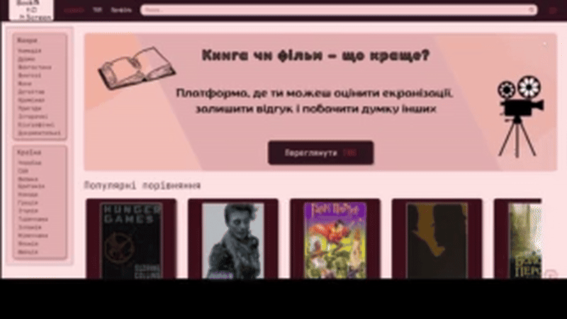

### Додаткові можливості фільтрації
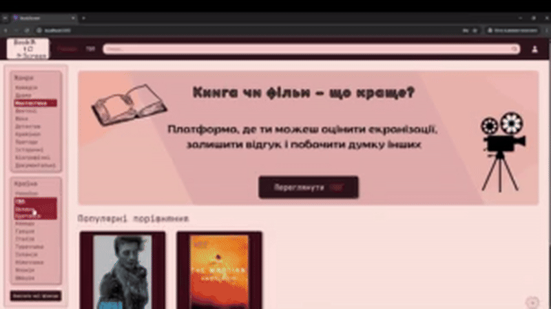

### Вхід у систему (Авторизація)
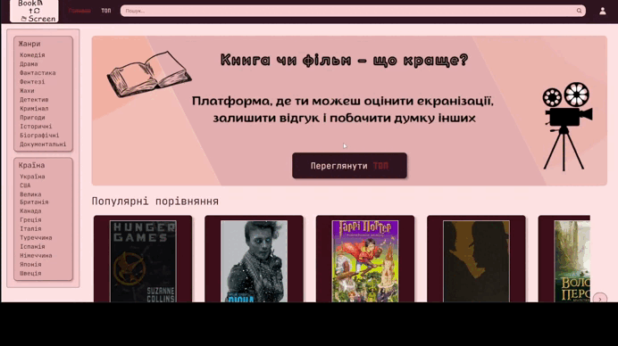

### Карта розбіжностей
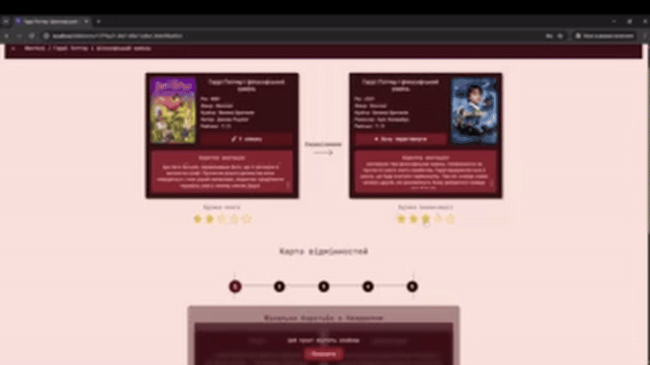

### Система скарг та модерація
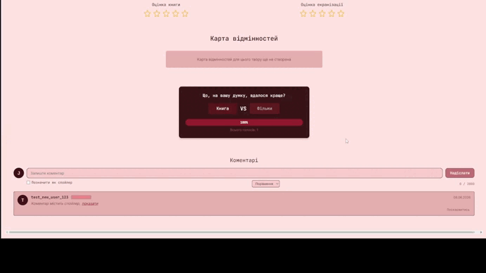

### Робота з коментарями
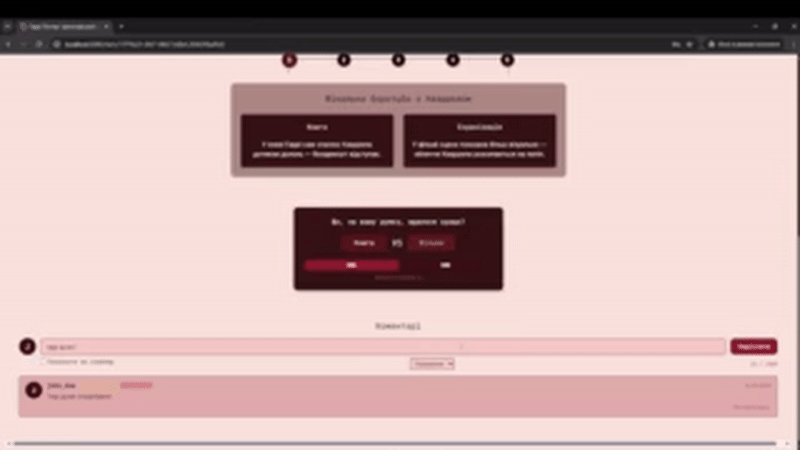

### Система голосування
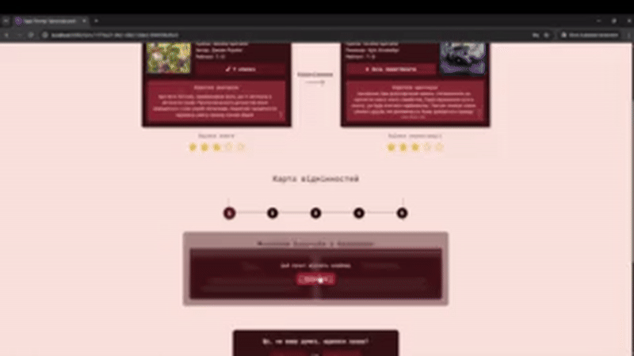

### Профіль та Обране
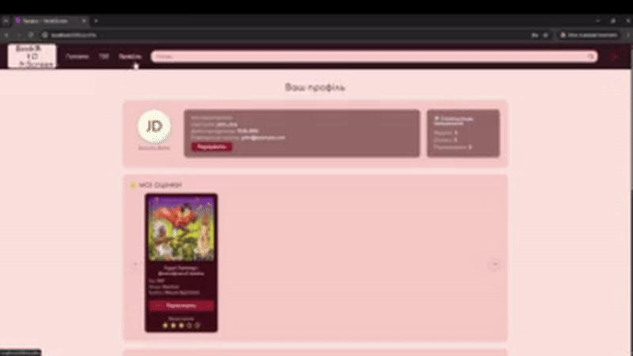

---

## Скріншоти інтерфейсу (Gallery)

### Каталог творів
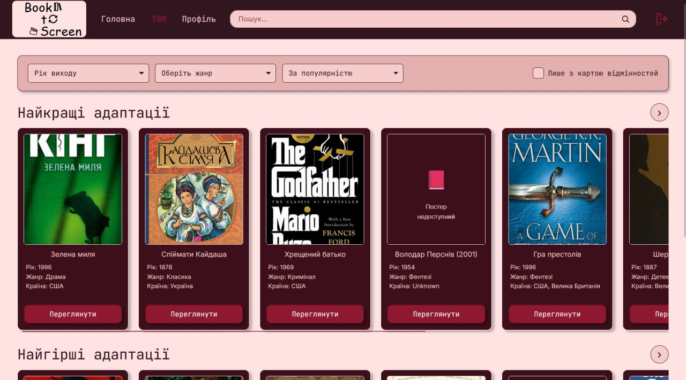

### Карта розбіжностей (Детально)
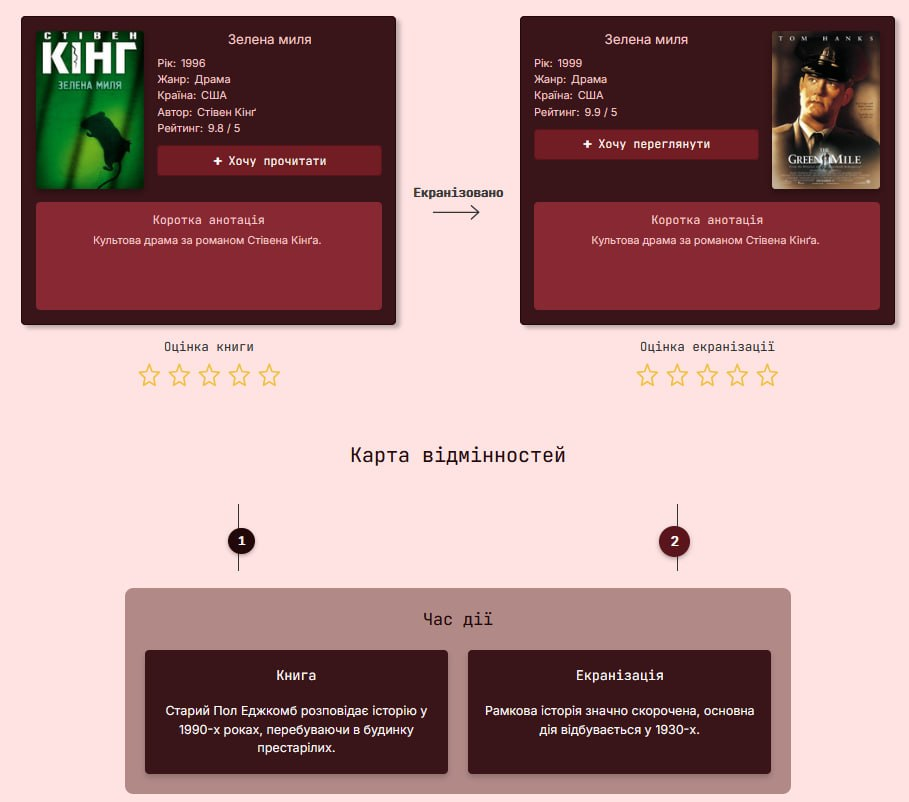

### Профіль користувача
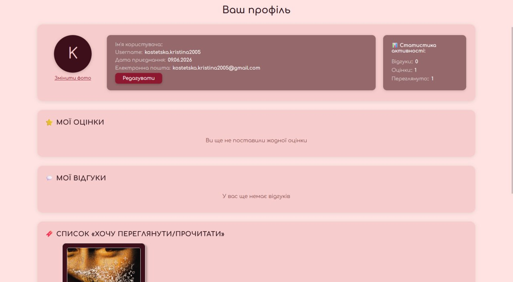

---

## Marketing Kit

Для ознайомлення з маркетинговими матеріалами проєкту перейдіть до папки [/marketing_kit](./marketing_kit). 

### Структура матеріалів:
- [Branding](./marketing_kit/branding): Логотипи (primary, white) та гайдлайн по стилю (Style Guide).
- [Video](./marketing_kit/video): Промо-ролик продукту та обкладинка.
- [Copywriting](./marketing_kit/copywriting): Текст 60-секундної промови (Elevator Pitch).
- [Strategy](./marketing_kit/strategy): Аналіз ринку (SWOT, конкуренти) та календарний план просування (Social Media Plan).
