# Book2Screen — Посібник користувача

> **Версія:** 1.0 · **Етап:** 6 · **Дата:** червень 2026

---

## Зміст

1. [Реєстрація та вхід](#1-реєстрація-та-вхід)
2. [Головна сторінка та навігація](#2-головна-сторінка-та-навігація)
3. [Пошук](#3-пошук)
4. [ТОП адаптацій](#4-топ-адаптацій)
5. [Сторінка твору](#5-сторінка-твору)
6. [Інтерактивна карта відмінностей](#6-інтерактивна-карта-відмінностей)
7. [Голосування «Книга vs Фільм»](#7-голосування-книга-vs-фільм)
8. [Відгуки та коментарі](#8-відгуки-та-коментарі)
9. [Зіркові оцінки](#9-зіркові-оцінки)
10. [Список «Хочу переглянути/прочитати»](#10-список-хочу-переглянутипрочитати)
11. [Особистий профіль](#11-особистий-профіль)
12. [Адмін-панель](#12-адмін-панель)

---

## 1. Реєстрація та вхід

> **Юзер-сторі US 1.1 / 1.2** — Користувач може створити акаунт або увійти в існуючий.

### Як увійти

Натисніть іконку профілю у правому верхньому куті шапки — вона виглядає як силует людини.

З'явиться модальне вікно **«Вхід»** з полями **Логін** (email) та **Пароль**, посиланням «Забули пароль?» і двома кнопками — «Увійти» та «Зареєструватись».

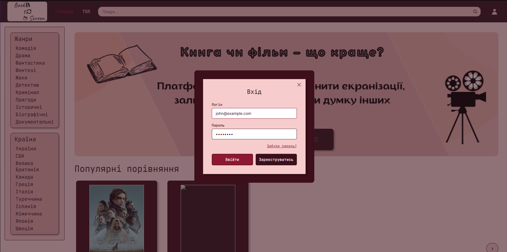

1. Введіть email та пароль.
2. Натисніть **«Увійти»**.
3. Після успішного входу шапка оновиться — з'являться посилання «ТОП» та «Профіль».

### Як зареєструватися

Натисніть **«Зареєструватись»** у вікні входу. Відкриється форма **«Реєстрація»** з трьома полями:

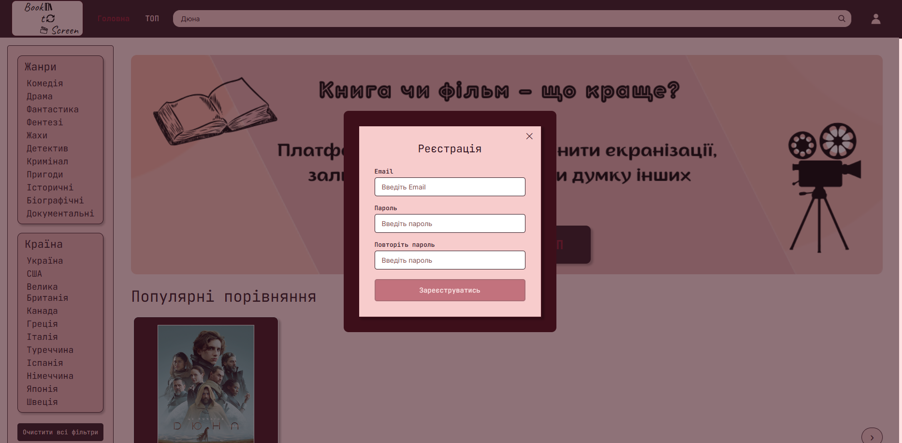

- **Email** — ваша електронна пошта.
- **Пароль** — мінімум 8 символів.
- **Повторіть пароль** — підтвердження паролю.

Натисніть **«Зареєструватись»** — відбудеться автоматичний вхід.

### Відновлення паролю

1. У вікні входу натисніть **«Забули пароль?»**.
2. Введіть email — на нього прийде код підтвердження.
3. Введіть код та встановіть новий пароль.

> **Тестові облікові записи:**
> - Адміністратор: `admin@book2screen.com` / `Admin123!`
> - Користувач: `john@example.com` / `User123!`

---

## 2. Головна сторінка та навігація

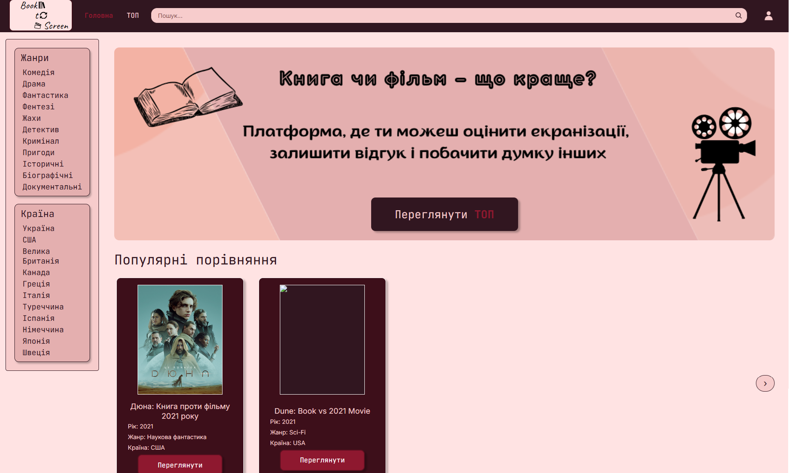

Головна сторінка складається з трьох зон:

**Шапка** — логотип Book2Screen, посилання «ТОП», поле пошуку та іконка профілю. Після входу з'являється також посилання «Профіль».

**Бічна панель фільтрів** (ліворуч) — два блоки:
- **Жанри** — Комедія, Драма, Фантастика, Фентезі, Жахи, Детектив, Кримінал, Пригоди, Історичні, Біографічні, Документальні.
- **Країни** — Україна, США, Велика Британія, Канада, Греція, Італія, Туреччина, Іспанія, Японія та інші. Внизу кнопка «Очистити всі фільтри».

**Центральна зона** — Hero-банер «Книга чи фільм — що краще?» з описом платформи та кнопкою «Переглянути ТОП». Нижче — секція **«Популярні порівняння»** з картками творів і стрілкою прокрутки → справа.

### Навігація

| Елемент | Дія |
|---------|-----|
| Логотип Book2Screen | Повернутись на головну |
| Поле пошуку | Ввести запит і натиснути Enter |
| «ТОП» | Перейти на сторінку рейтингів |
| Іконка профілю | Відкрити вікно входу (або профіль) |
| Картка твору | Перейти на сторінку деталей |

---

## 3. Пошук

> **Юзер-сторі US 2.1** — Знайти твір за назвою, автором або жанром.

Введіть запит у поле пошуку в шапці та натисніть **Enter**. Результати відображаються прямо на головній сторінці — фільтри звузять список до відповідних карток.

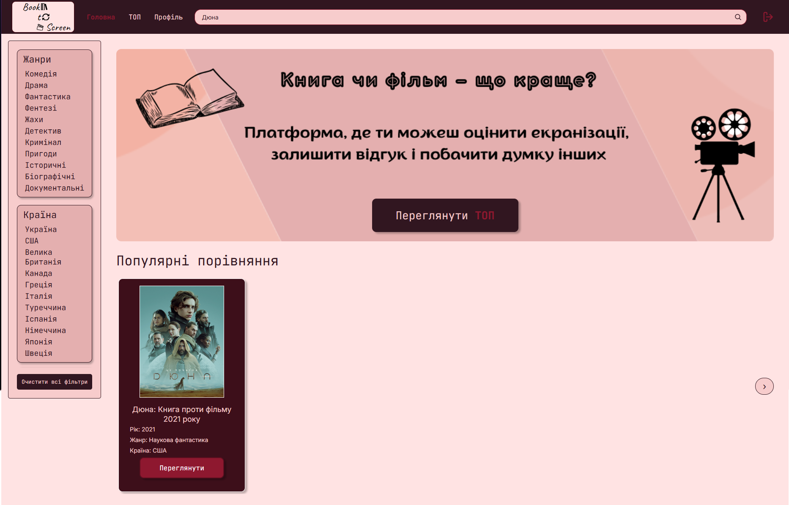

На скріншоті — результат пошуку за запитом «Дюна»: відображається одна картка «Дюна: Книга проти фільму 2021 року» з постером, метаданими (жанр, країна) та кнопкою «Переглянути».

Бічна панель жанрів і країн залишається активною — можна додатково звузити результати фільтрами.

---

## 4. ТОП адаптацій

> **Юзер-сторі US 3.1** — Рейтинг найкращих і найгірших екранізацій.

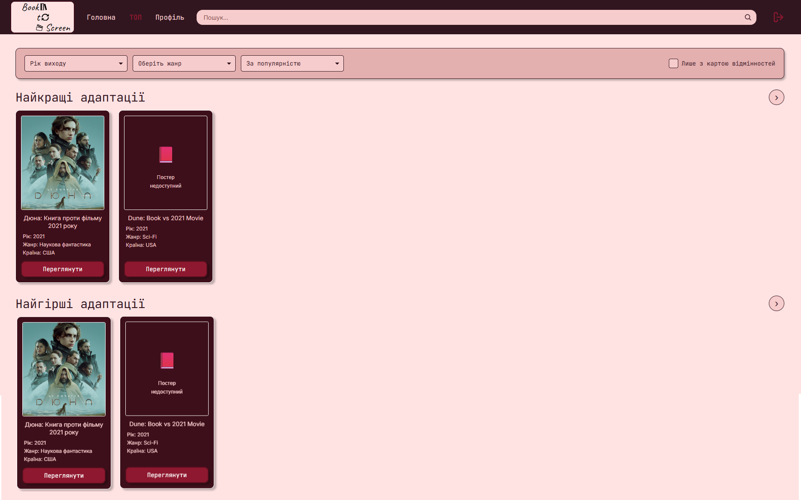

Сторінка **ТОП** має два рівні:

**Фільтр-бар** зверху з трьома елементами керування:
- «Рік виходу» — фільтр за роком.
- «Оберіть жанр» — фільтр за жанром.
- «За популярністю» — сортування.
- Чекбокс **«Лише з картою відмінностей»** — показати тільки твори з інтерактивною картою.

**Дві секції** з горизонтальними каруселями та стрілкою → для прокрутки:
- **Найкращі адаптації** — твори з найвищим рейтингом екранізації.
- **Найгірші адаптації** — твори, де екранізація значно поступилась книзі.

---

## 5. Сторінка твору

> **Юзер-сторі US 3.2** — Деталі твору з повним порівнянням книги та екранізації.

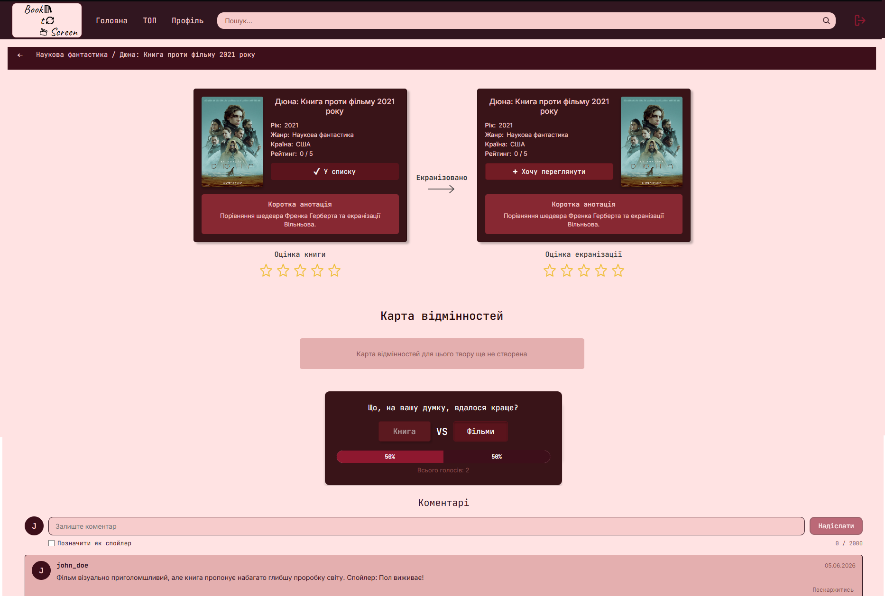

Над сторінкою — **хлібні крихти**: «Наукова фантастика / Назва твору» зі стрілкою повернення назад.

### Картки порівняння

Дві картки розташовані поруч — між ними напис «Екранізовано →»:

- **Ліва картка** — книга: постер, назва, рік, жанр, країна, рейтинг, опис і кнопка дії (вішліст).
- **Права картка** — екранізація: аналогічна структура.

Під кожною карткою — блок **«Оцінка книги»** / **«Оцінка екранізації»** із зірками (1–5).

### Нижче на сторінці

- **Карта відмінностей** — якщо для твору створена (або заглушка «для цього твору ще не створена»).
- **Блок голосування** — «Що, на вашу думку, вдалось краще?»
- **Коментарі** — форма та список відгуків.

---

## 6. Інтерактивна карта відмінностей

> **Killer Feature платформи** — горизонтальна шкала ключових відмінностей між книгою та фільмом.

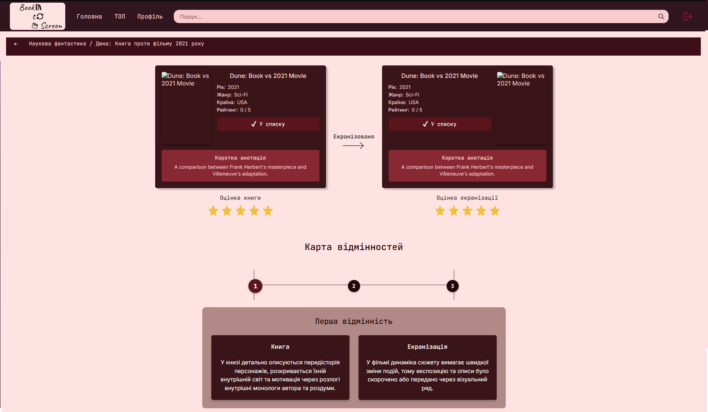

Карта відображається у вигляді **горизонтального таймлайну** з пронумерованими точками (① ② ③ …). Клік на точку — відкриває відповідний блок нижче.

Кожен блок містить дві колонки поруч:

| **Книга** | **Екранізація** |
|-----------|-----------------|
| Опис того, як сцена/подія виглядає в оригінальній книзі | Опис того, як це змінено або подано у фільмі |

### Спойлери

Якщо відмінність позначена як спойлер — текст обох колонок **розмивається**, заголовок «Цей пункт містить спойлер» і кнопка **«Показати»**.

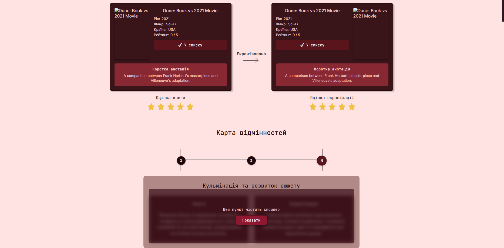

Натисніть «Показати» — текст стане видимим лише для вас.

---

## 7. Голосування «Книга vs Фільм»

> **UC-04** — Проголосувати, що сподобалось більше.

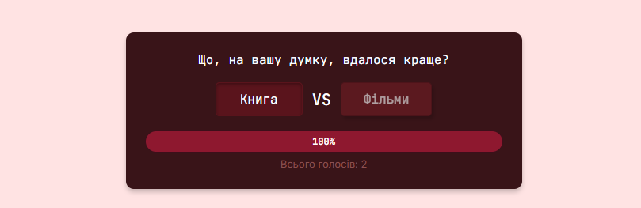

Блок **«Що, на вашу думку, вдалося краще?»** розташований нижче карти відмінностей. Він містить:

- Дві кнопки: **«Книга»** та **«Фільми»**.
- **Прогрес-бар** — показує розподіл голосів у відсотках.
- Лічильник **«Всього голосів»**.

Натисніть «Книга» або «Фільми» — прогрес-бар одразу оновиться. Ваш голос зберігається, повторно проголосувати не можна.

> Для голосування потрібна **авторизація**.

---

## 8. Відгуки та коментарі

> **Юзер-сторі US 6.1** — Написати відгук або поскаржитись на коментар.

Блок **«Коментарі»** знаходиться в самому низу сторінки твору. Форма введення складається з:
- Аватара з першою літерою нікнейму.
- Поля вводу тексту (10–2000 символів) з лічильником символів.
- Чекбоксу **«Спойлер»** — розмиє текст для інших.
- Кнопки **«Надіслати»**.

### Як залишити відгук

1. Прокрутіть сторінку до блоку «Коментарі».
2. Введіть текст (мінімум 10 символів).
3. За потреби позначте «Спойлер».
4. Натисніть **«Надіслати»**.

> Для відгуків потрібна **авторизація**.

### Як поскаржитись

На кожному коментарі є кнопка **«Поскаржитись»**. Натисніть її, оберіть причину зі списку та надішліть — скарга піде на розгляд модератора.

---

## 9. Зіркові оцінки

Під картками порівняння на сторінці твору є два блоки зірок:
- **«Оцінка книги»** — клікніть на зірку (1–5).
- **«Оцінка екранізації»** — клікніть на зірку (1–5).

Оцінка зберігається і буде відображена у вашому профілі в розділі **«Мої оцінки»**.

> Для оцінювання потрібна **авторизація**.

*(Зіркові оцінки видно на скріншоті сторінки твору у розділі 5 та на скріншоті карти відмінностей у розділі 6.)*

---

## 10. Список «Хочу переглянути/прочитати»

> **Юзер-сторі US 1.3** — Зберегти твір для майбутнього.

На картках порівняння є кнопки:
- **«+ Хочу прочитати»** — для книги.
- **«+ Хочу переглянути»** — для екранізації.

Після натискання кнопка змінюється на **«✓ У списку»**. Повторний клік — прибирає твір зі списку.

Переглянути збережені твори можна у **Профілі** → секція **«Список "Хочу переглянути/прочитати"»**.

*(Кнопки вішліст видно на скріншоті сторінки твору у розділі 5.)*

---

## 11. Особистий профіль

> **Юзер-сторі US 1.3** — Особиста сторінка з усією активністю.

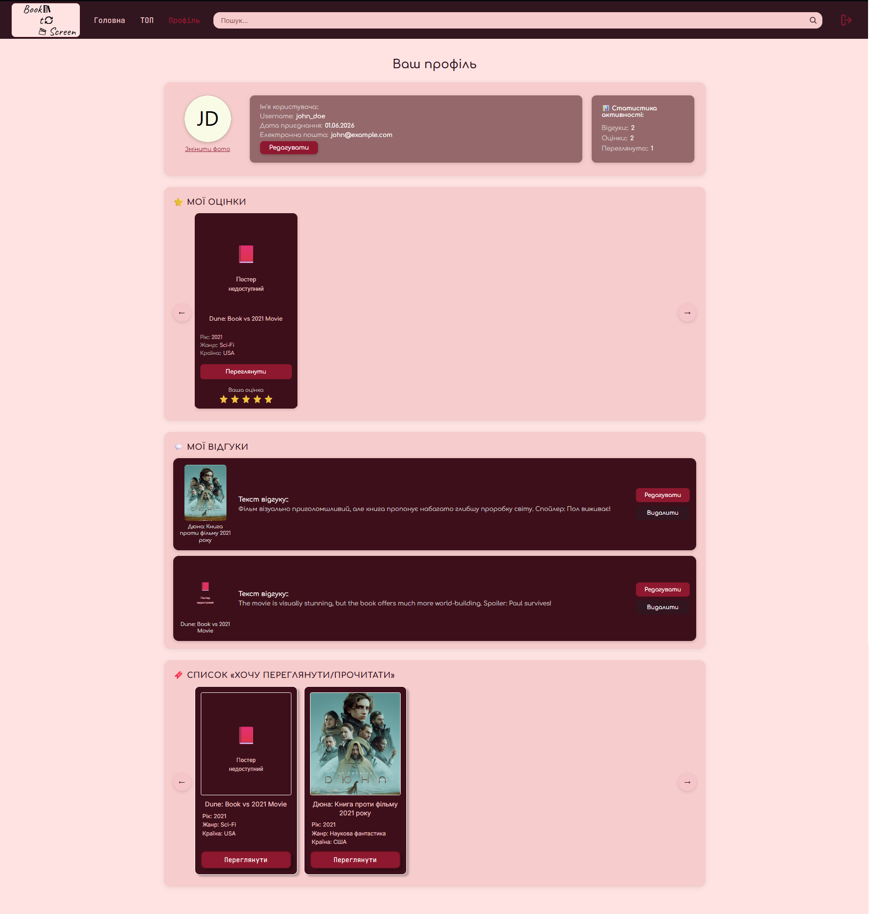

### Шапка профілю

Містить три блоки в одному рядку:
- **Аватар** (ліворуч) — кругове фото або ініціали. Кнопка **«Змінити фото»** для завантаження зображення.
- **Дані користувача** (по центру) — нікнейм, email, кнопка **«Редагувати»** для зміни імені.
- **Статистика активності** (праворуч) — лічильники: Відгуків, Оцінок, Переглянуто.

### ⭐ МОЇ ОЦІНКИ

Горизонтальна карусель карток із кнопками ← → для прокрутки. Кожна картка показує постер, назву, жанр, країну, рейтинг, кнопку «Переглянути» та зірки «Ваша оцінка».

### 💬 МОЇ ВІДГУКИ

Список ваших коментарів. Кожен рядок: постер твору + назва зліва, текст відгуку по центру, кнопки **«Редагувати»** та **«Видалити»** праворуч. Кнопка **«Показати більше»** — завантажує наступні відгуки.

### 🔖 СПИСОК «ХОЧУ ПЕРЕГЛЯНУТИ/ПРОЧИТАТИ»

Горизонтальна карусель збережених творів із кнопками ← → для прокрутки.

---

## 12. Адмін-панель

> Доступна лише користувачам з роллю **Admin** або **Moderator**. Посилання «Адмін-панель» з'являється у шапці після входу.

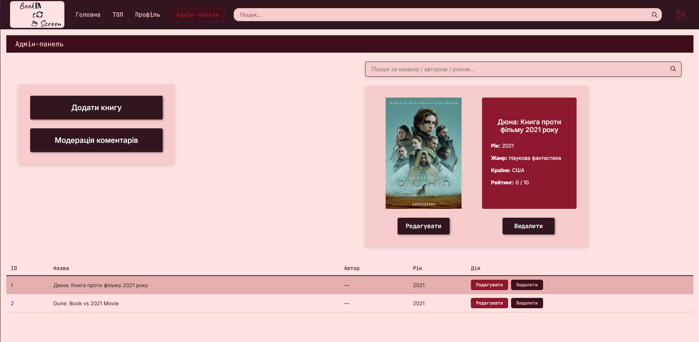

### Список творів

Сторінка має три зони:

**Ліворуч** — дві кнопки:
- **«Додати книгу»** — відкриває форму створення нового твору.
- **«Модерація коментарів»** — перехід до таблиці скарг.

**По центру** — поле пошуку «Пошук за назвою / автором / роком...» і картка-превʼю вибраного твору (постер, назва, жанр, країна, рейтинг) з кнопками **«Редагувати»** та **«Видалити»**.

**Внизу** — таблиця всіх творів: ID, Назва, Автор, Рік, Дія (кнопки «Редагувати» / «Видалити»). Клік на рядок — оновлює картку-превʼю.

### Форма додавання / редагування твору

Форма розділена на дві колонки:

- **Ліва** — поля: Назва, Автор, Рік виходу, Жанр (випадаючий список), Завантажити зображення (URL постера), Короткий опис. Внизу кнопка «+ Додати екранізацію».
- **Права** — редактор **«Інтерактивна карта відмінностей»**: кнопка «Додати нову точку», для кожної точки — Заголовок, Сцена в книзі, Сцена у фільмі, чекбокс «Спойлер».

Внизу правої колонки — кнопки **«Підтвердити»** (зберегти) та **«Скасувати»** (повернутись без змін).

### Модерація коментарів

Таблиця скарг від користувачів із колонками: Причина, Текст коментаря, Дія. Для кожної скарги доступні три кнопки:

| Кнопка | Результат |
|--------|-----------|
| **Схвалити** | Скаргу відхилено, коментар залишається |
| **Видалити** | Коментар видаляється з платформи |
| **Спойлер** | Текст коментаря розмивається як спойлер |

---

*Посібник підготовлено для фінальної здачі Етапу 6 — README\_Verification\_Report.*
