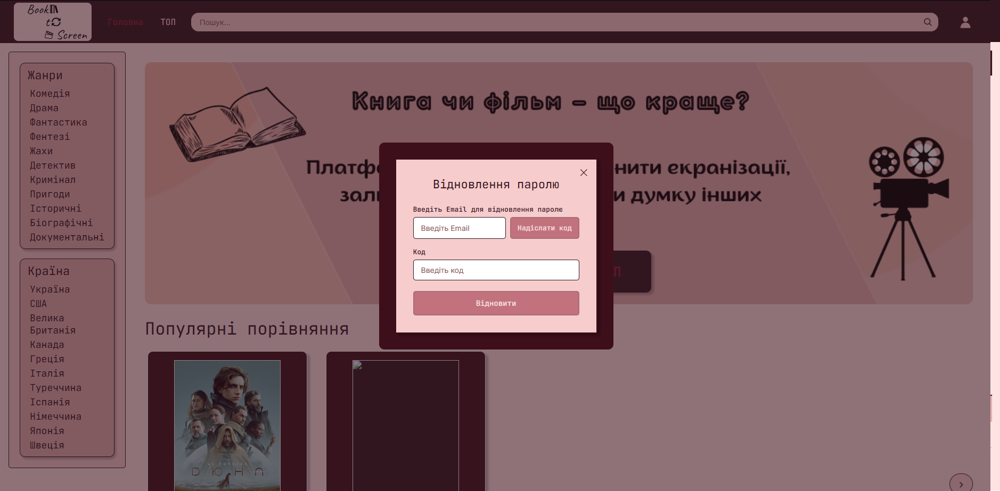

# Посібник користувача Book2Screen

Book2Screen — платформа для порівняння книг та їх екранізацій: рейтинги, карти відмінностей сюжету, голосування «книга проти фільму» та спільнота, що ділиться враженнями.

Цей посібник структуровано за епіками та користувацькими історіями (User Stories) з беклогу проєкту, щоб кожен розділ відповідав конкретній реалізованій функціональності.

**Тестові облікові записи:**
- Адміністратор: `admin@book2screen.com` / `Admin123!`
- Звичайний користувач: `john@example.com` / `User123!`

Інтерфейс складається з трьох основних зон: верхній хедер з навігацією та пошуком, бічна панель з фільтрами за жанром і країною, а також головна область з банером і картками порівнянь «Книга проти фільму».

---

## Epic 1. Авторизація та реєстрація

### US 1.1 — Реєстрація нового користувача

Щоб створити обліковий запис, натисніть «Увійти» у верхньому правому куті та оберіть вкладку реєстрації. Заповніть ім'я користувача, email та пароль.

Після успішної реєстрації система автоматично авторизує вас і відкриває доступ до персональних можливостей: оцінок, відгуків і списку бажаного.

### US 1.2 — Вхід та відновлення паролю

Для входу введіть email і пароль у формі авторизації.

Якщо ви забули пароль, скористайтеся посиланням «Забули пароль?» — система запропонує вказати email для надсилання інструкцій з відновлення.

Для перевірки можна використати тестові облікові записи, наведені на початку посібника.

### US 1.3 — Особистий профіль і список бажаного

У профілі (вкладка «Профіль» у хедері) зібрана вся персональна активність користувача: аватар, базова статистика, розділи «Мої оцінки», «Мої відгуки» та список «Хочу переглянути / прочитати».

Додати твір до списку бажаного можна прямо з картки твору на головній сторінці, у пошуку чи в Топ-адаптаціях — кнопкою з позначкою обраного. Прибрати твір зі списку можна тим самим способом або безпосередньо зі сторінки профілю.

---

## Epic 2. Розширений пошук і фільтрація

### US 2.1 — Пошук творів

Поле пошуку розташоване у верхньому хедері на кожній сторінці. Введіть назву книги, автора або жанр — наприклад, «Дюна» — і натисніть Enter або іконку лупи.

Система виводить список відповідних творів із карткою постера, роком виходу, жанром і країною виробництва, а також лічильник знайдених результатів.

### US 2.2 — Фільтрація за жанром, роком і країною

Окрім текстового пошуку, доступна фільтрація через бічну панель (жанри, країни) та панель фільтрів над списками — за роком виходу, жанром і типом сортування (наприклад, «За популярністю»).

Фільтри можна комбінувати: наприклад, обрати жанр «Наукова фантастика» в боковій панелі та одночасно відсортувати результати за роком виходу. Додатковий чекбокс «Лише з картою відмінностей» дозволяє показувати тільки ті твори, для яких уже складено інтерактивне порівняння сюжету.

---

## Epic 3. Каталог та Топ-адаптації

### US 3.1 — Рейтинг кращих і гірших екранізацій

Розділ «ТОП» у головному меню відкриває два списки — «Найкращі адаптації» та «Найгірші адаптації», сформовані на основі оцінок спільноти.

Кожна картка містить постер, назву, рік, жанр і країну, а кнопка «Переглянути» веде на детальну сторінку твору. Списки можна гортати горизонтально й фільтрувати тією ж панеллю фільтрів, що й у пошуку.

### US 3.2 — Сторінка твору з деталями порівняння

Сторінка твору («Переглянути» з будь-якої картки) показує парне порівняння книги та екранізації: дві картки з постерами, описом, роком виходу і жанром, з'єднані стрілкою «Екранізовано».

Тут зосереджено всі ключові інструменти порівняння: зіркові оцінки книги й фільму, кнопка переходу до інтерактивної карти відмінностей, блок голосування «Книга проти фільму» та стрічка коментарів і відгуків спільноти.

---

## Epic 4. Адаптивність інтерфейсу

### US 4.1 — Коректне відображення на різних пристроях

Інтерфейс Book2Screen побудовано на адаптивній сітці, що автоматично перебудовується під розмір екрана:

- на широких екранах (десктоп) бічна панель фільтрів та основний контент відображаються поруч у дві колонки;
- на планшетах і вузьких вікнах бічна панель переноситься над основним контентом або згортається у випадаюче меню;
- на мобільних екранах навігаційне меню стискається в компактний вигляд (іконки замість тексту, бургер-меню), картки творів вишиковуються в один стовпець, а блоки порівняння на сторінці твору розташовуються вертикально один під одним замість пліч-о-пліч.

Щоб перевірити адаптивність самостійно, змініть розмір вікна браузера або відкрийте застосунок на мобільному пристрої — усі елементи (пошук, фільтри, картки, карта відмінностей, форми голосування й відгуків) залишаються повністю функціональними та читабельними незалежно від ширини екрана.

---

## Epic 5. Система голосування (рейтинг)

### US 5.1 — Голосування «Книга проти фільму»

На сторінці твору розташований блок голосування з питанням «Що, на вашу думку, вдалося краще?» і двома кнопками вибору — «Книга» та «Фільми».

Після голосування (доступне лише авторизованим користувачам) система показує загальний прогрес-бар із відсотковим співвідношенням голосів і лічильник «Всього голосів». Кожен користувач може проголосувати по конкретному твору лише один раз, але може змінити свій вибір пізніше.

### US 5.2 — Зіркові оцінки книги і фільму

Окремо від голосування «книга проти фільму» користувачі можуть виставити власну зіркову оцінку (1–5 зірок) книзі та екранізації — кожна оцінюється незалежно.

Блоки оцінок розташовані під картками порівняння на сторінці твору (див. скриншот сторінки твору в Epic 3, US 3.2) та в карті відмінностей.

Виставлені оцінки впливають на середній рейтинг твору, який використовується для формування списків «Найкращі / найгірші адаптації» в розділі ТОП. Власні оцінки також зберігаються в розділі «Мої оцінки» особистого профілю.

---

## Epic 6. Відгуки та коментарі

### US 6.1 — Залишення відгуку

У нижній частині сторінки твору розташована форма для написання відгуку. Текст відгуку має містити від 10 до 2000 символів; також можна позначити чекбокс «Містить спойлери», щоб приховати текст відгуку за розмиттям, доки інший користувач не розкриє його свідомо.

Опубліковані відгуки відображаються у стрічці під формою з ім'ям автора, датою та текстом (або розмитим текстом, якщо позначено спойлер). Власні відгуки також зберігаються в розділі «Мої відгуки» особистого профілю.

### US 6.2 — Скарги на коментарі та модерація

Якщо відгук або коментар порушує правила спільноти, його можна позначити як неприйнятний — кнопкою «Поскаржитись» поруч із текстом відгуку. У вікні, що відкриється, потрібно вказати причину скарги.

Скарги надходять до адміністраторів платформи, які розглядають їх у розділі «Модерація коментарів» адмін-панелі (див. Додаток A) і ухвалюють рішення про приховування чи видалення контенту, що порушує правила.

---

## Epic 7. Інтерактивна карта відмінностей

### US 7.1 — Перегляд карти відмінностей між книгою і фільмом

Кнопка «Карта відмінностей» на сторінці твору відкриває інтерактивну часову шкалу, що покроково показує, чим сюжет екранізації відрізняється від книги.

Кожна точка шкали — це одна сюжетна відмінність: ліворуч описано, як подію подано в книзі, праворуч — як її змінено у фільмі. Перемикаючись між точками, можна простежити всі ключові розбіжності в хронологічному порядку.

Якщо відмінність стосується розвитку сюжету, який користувач ще не бачив, текст можна приховати за спойлер-розмиттям і розкрити свідомим натисканням — це дозволяє безпечно досліджувати карту, не боячись випадково дізнатися фінал.

---

## Додаток A. Адмін-панель

Користувачі з роллю адміністратора (наприклад, тестовий обліковий запис `admin@book2screen.com`) бачать у хедері додатковий пункт «Адмін-панель».

Адмін-панель надає такі можливості:

- **Керування каталогом** — додавання нових творів («Додати книгу»), редагування й видалення наявних карток через таблицю з пошуком за назвою, автором чи роком;
- **Редактор карти відмінностей** — створення та редагування точок порівняння книги й екранізації для конкретного твору;
- **Модерація коментарів** — перегляд скарг користувачів на відгуки й коментарі (US 6.2) та ухвалення рішень щодо прихованого чи видаленого контенту.

---

*Цей посібник відображає функціональність застосунку Book2Screen відповідно до структури епіків і користувацьких історій проєктного беклогу (Epic 1–7).*
